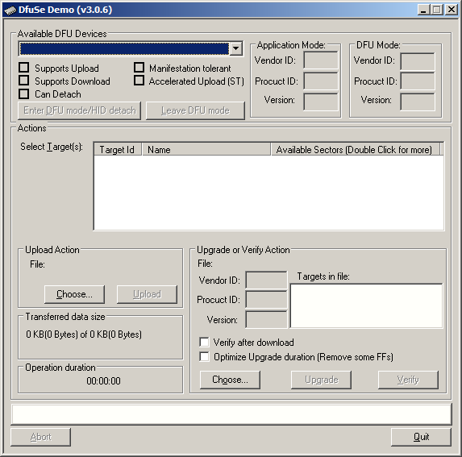

# Firmware
The newest firmware can be always [found here](https://github.com/gp8-stopwatch/receiver-firmware/releases). Always pick up the newest one.

# Windows
Install [ST's DFU program](https://www.st.com/en/development-tools/stsw-stm32080.html) (login required). Run the program. A window will pop up:



Connect the stopwatch, and then turn it on **holding the button pressed on**. The stopwatch should then be recognized and it should show up in the combo box as depicted below. The screen does not lit up in this mode :


Pick a firmware file you want to use. The newest firmware can be always [found here](https://github.com/gp8-stopwatch/receiver-firmware/releases).


Simply click the "Upgrade" button:


Click "Yes" if the popup like shown below shows up:


# Linux
Manjaro : install `dfu-util` and run it as so:

```sh
dfu-util -D receiver.dfu -a0
```
