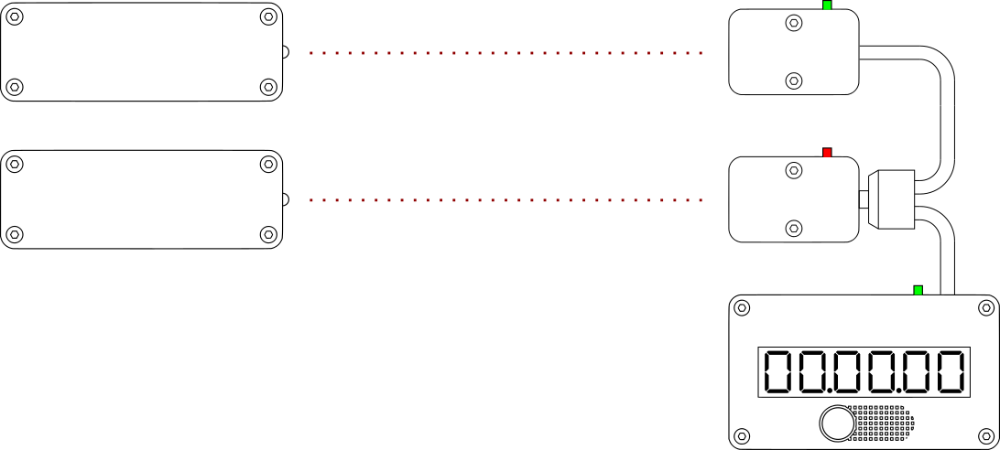

# Possible configurations
A transmitter with a receiver is called *a gate*. Crossing such a gate triggers the Gp8 stopwatch causing it to start or stop. A number of different setups exist.

Note that the Gp8 stopwatch was designed for outdoor usage, and thus its transmitter emits very strong beam of infrared light. While advantageous outdoors, it can cause certain problems indoors, where IR beam can get reflected from the walls or furniture. In such cases (even though the device wasn't designed for this) set the transmitter to the lowest, and move the transmitter and receiver farther away.

## Built-in receiver only
In this configuration, the gate is formed using a transmitter (left side of the picture), and the Gp8 stopwatch with the internal sensor turned on. 

## External receiver
In this configuration, a user decided to use the external receiver that comes with an extension cable. This allowed him to move the gate farther away from the Gp8 stopwatch itself making the whole setup more comfortable to use. The internal sensor built into the Gp8 stopwatch was turned off.

Note that the two terminator switches (depicted in green) are turned on on both devices. Always turn on the terminators on both ends of the chain while keeping others turned off. 

## Built-in & external receivers
Two gates can be set up using one external receiver along with the Gp8 stopwatch's built-in sensor. The internal sensor built into the Gp8 stopwatch has to be turned on for this setup to work.

Crossing either of the gates triggers the Gp8 stopwatch, which enables you to place start and finish in different places. 

Note that the two terminator switches (depicted in green) are turned on on both devices. Always turn on the terminators on both ends of the chain while keeping others turned off. 

## Two external receivers
More than one external receiver can be used at the same time by using a splitter. The devices can be chained together, but remember to adjust the terminators accordingly. On the image below the terminators on both ends are on (green), while the one in the middle is off (red).

