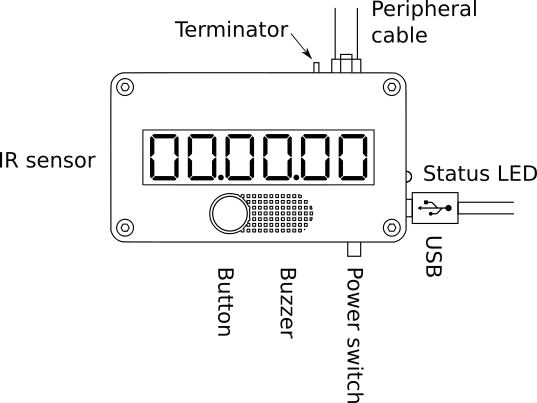

# Stopwatch
Depicted below is the top view of the stopwatch:

* **IR sensor** along with the IR transmitter form a gate. Object crossing that gate triggers the stopwatch starting or stopping it. 
* **Button** lets you to cycle through available options and to change some of them. See [On-screen menu](screen-menu.html) section.
* **Buzzer** can be turned on/off.
* **Power switch**.
* **USB** is for charging the built-in LiPo battery and connecting the stopwatch to a computer. The device acts as a serial port and thus can be accessed via a serial console application. See [USB drivers installation](usb-drivers.html) for more info on the driver installation and [USB commands](usb-commands.html) for more info about the available commands.
* **Status LED** shows the charging status. Red color means charging is in progress, while green means that the charging is complete. Full charging may take up to 5 hours.
* **Peripheral cable** can be connected to the peripheral port. Devices use six-wire telephone cable with 6p6c connectors. Using a splitter, one can connect more than one peripheral device like the external IR sensor.
* **Terminator** switch lets you turn the terminator on or off. The terminator is used only when a peripheral or peripherals are connected. The rule is that devices at both ends of the chain have to have terminators turned on, while all other devices must have terminators switched off. If you have only two devices connected, leave the switches in the "1" position.

# Transmitter

The transmitter consists of:
* **USB** socket for charging internal LiPo battery.
* **Status LED** that indicates the state of the charging.
* **Power switch**.
* **Intensity** switch lets you choose between three presets of IR intensity. As a rule of thumb, always start from the weakest signal (depiceted on the case as a minus sign). Then if the distance between the transmitter and the receiver is very long, try to increase the intensity by one click. Use the lowest setting at night. If the signal is too strong even on the lowest setting, try move the transmitter further away. This version was designed for outdoor usage and can be operated in the presense of sunlight. 
* **IR source**. This is a infra red LED. Point it towards the receiver.

# External receiver
One or more external receivers can be connected to the stopwatch. Each receiver needs its own transmitter. Together they form a light barrier also referred to as a *gate* throughout this documentation.

* **IR sensor** : infraref sensitiove element. Point it towards the transmitter's IR LED.
* **Peripheral cable** connects the micro receiver to the main stopwatch.
* **Terminator** switch. See the description above. 