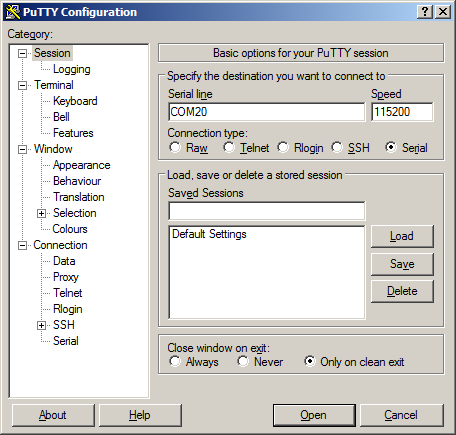

# Windows
Windows versions prior to Windows 10 require a driver installation. You can find it in [this link](https://www.st.com/en/development-tools/stsw-stm32102.html). Unfortunately, an email address is required in the process.


Install the driver:


Connect the gp8 stopwatch, turn it on and observe if it is actually recognized by Windows. You can use Windows Device Manager for this:


Download and install [Putty](https://www.putty.org/) and open it. You will be presented with a configuration dialog where you need to set the "Serial" option using radio-buttons depicted below. Set "Serial line" to the value observbed in the previous step and set "Speed" to 115200 baud. 



Click open, and a terminal window should appear:


Input "help" for available commands.

# Linux
Use your favorite serial terminal:

``` sh
dterm /dev/ttyACM0 115200
```

In case of any trouble, turn the stopwatch off, run `dmesg -w`, and observe the kernel logs after powering the stopwatch again. You should see something like this:

```
[15720.611477] usb 2-4.2.2: new full-speed USB device number 15 using xhci_hcd
[15720.703165] usb 2-4.2.2: New USB device found, idVendor=0483, idProduct=5740, bcdDevice= 2.00
[15720.703168] usb 2-4.2.2: New USB device strings: Mfr=1, Product=2, SerialNumber=3
[15720.703170] usb 2-4.2.2: Product: CDC
[15720.703171] usb 2-4.2.2: Manufacturer: iwasz.pl
[15720.703172] usb 2-4.2.2: SerialNumber: 208035635934
[15720.711871] cdc_acm 2-4.2.2:1.0: ttyACM1: USB ACM device
```

Another useful command which can help to debug USB issues is `lsusb`. 